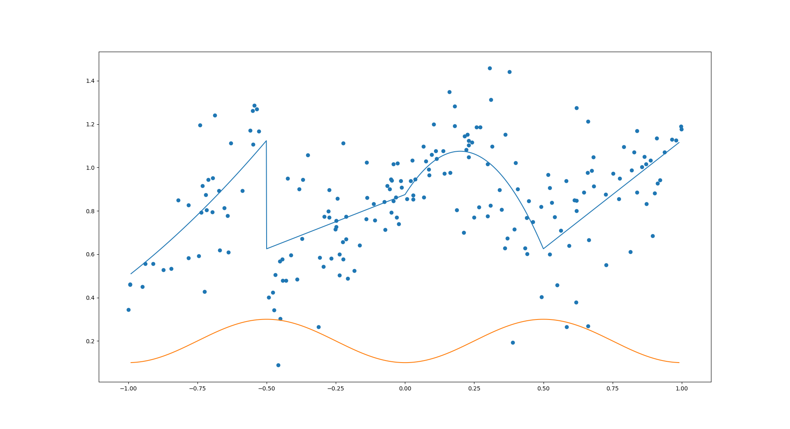

# Ejercício 2 de aprendeizaje estadístico (31/8)



```
(0.1141120134,1.04048721756)
(0.529858534749,0.838050790599)
(-0.910836808578,0.556488301841)
(0.727273323171,0.551215703587)
(-0.492609289677,0.400879202281)
(-0.528402964615,1.16716120426)
(0.7761679951,0.949670193076)
(-0.0560476606892,0.900135111813)
(-0.0223557633207,0.739996034223)
(0.377223109768,1.44062355333)
(-0.68715529409,1.24084147517)
(-0.473535434368,0.342977944776)
(-0.938402097932,0.555617879498)
(0.887697935841,1.03280929093)
(-0.0267397613137,1.01874793338)
(-0.24898734753,0.755265871734)
(-0.845623513505,0.533299331828)
(0.180019508132,1.28176005842)
(0.369227455879,0.672639709293)
(0.298779028442,0.776123327039)
(-0.0493552926306,0.792538282746)
(0.02588787115,1.03351429011)
(0.618784715571,1.27483025405)
(-0.424312544226,0.949237270921)
(0.902121624014,0.881061364629)
(-0.0415265822337,0.846413525368)
(0.661202915813,1.21323099539)
(0.523491316042,0.906486981102)
(0.997865541904,1.18956497656)
(0.388364222214,0.19250639048)
(0.870691443031,1.01594992512)
(0.0672984234753,0.863286431459)
(-0.696406245311,0.794313064585)
(0.400096224478,1.02171583038)
(-0.108390970366,0.756003763054)
(0.43368954135,0.628504517542)
(-0.139716968804,0.762937204676)
(0.103269340437,1.1986086717)
(0.999067504976,1.17590123955)
(-0.629672115651,1.11324014597)
(-0.0711607903423,0.712747100104)
(-0.55039689722,1.26160397532)
(0.617818956104,0.37888712573)
(-0.458962891113,0.0889138601878)
(0.0873295157367,0.964646549798)
(0.342030700473,0.897038606558)
(0.872079413488,0.832380305074)
(-0.244236882452,0.85618150548)
(-0.653249854374,0.813775513277)
(-0.23621803221,0.503105842875)
(0.0291051838191,0.853634845092)
(-0.276310790122,0.797451735941)
(0.751130996556,0.972718006129)
(-0.640842332699,0.777771647008)
(-0.273819632302,0.76921870667)
(-0.294986307565,0.54284043116)
(-0.308349542346,0.585007793143)
(0.310138875523,1.312981598)
(-0.266819309846,0.580702758009)
(-0.138401191075,1.0234957627)
(-0.113799188814,0.831927527571)
(0.83793401397,0.886225440345)
(-0.41294551434,0.596245382052)
(0.020617291328,0.937396470292)
(-0.213173640268,0.772803147143)
(0.137606867343,1.07696247979)
(-0.441930892908,0.478793788604)
(-0.22444786246,0.656773463724)
(-0.0158365838928,0.937985458922)
(-0.993828872473,0.4600661145)
(0.141605347046,0.972708117535)
(-0.725193728085,0.428178718666)
(0.298198797421,1.01625892125)
(0.674266940138,0.986490820999)
(0.661738766259,0.268444031102)
(-0.212521046082,0.670597554668)
(-0.638266651688,0.609644459624)
(-0.45027503739,0.302850988697)
(0.309296979983,0.824311868893)
(-0.0741058115762,0.842663268732)
(-0.781827744508,0.582968791366)
(-0.24932523174,0.726730787)
(0.249158231789,0.769940662514)
(-0.371965977778,0.67238139554)
(-0.274503815572,0.896660909162)
(0.267893375481,0.81745762572)
(0.187397728676,0.803232945819)
(0.0751578767638,1.0292293542)
(-0.0124724369343,0.90761878019)
(0.855575535541,1.00348190781)
(0.096295536008,1.05982079527)
(0.584544422112,0.26456736108)
(0.446566019602,0.8451790008)
(-0.477804606308,0.424379201176)
(-0.236756490606,0.600370553221)
(0.111082648439,1.07553439484)
(-0.745829209669,0.592810632338)
(0.894797351311,0.685214376)
(0.34890070793,0.805246929797)
(0.066308790532,1.09663467631)
(0.813684965093,0.611449317599)
(0.271200218394,1.18549084139)
(-0.0297006237133,0.770752069967)
(-0.163723534435,0.640453924772)
(0.646889289965,0.884430292067)
(0.612009101499,0.849619120016)
(0.540950831701,0.772005901423)
(-0.711210954509,0.943879157273)
(-0.548556728016,1.10642226211)
(-0.382438843617,0.901308280949)
(-0.78246754574,0.826007075128)
(-0.0646468616555,0.914953108922)
(0.31398840969,1.09735635239)
(-0.0424952652784,1.01624073895)
(0.441578986232,0.600680796193)
(-0.545006669573,1.28608094155)
(0.979230466438,1.12577338292)
(-0.66940178818,0.617927511968)
(-0.0509841566289,0.946447402828)
(-0.587621139136,0.892738858134)
(-0.719731012939,0.874406460696)
(0.492530429475,0.403466689871)
(0.0865146932503,0.990330399826)
(0.395380130675,0.714589326623)
(0.549867243932,0.457321889471)
(0.938307877684,1.07071305378)
(0.910038187119,1.13416793135)
(-0.731497705695,0.91539198914)
(0.406517055464,0.900685311582)
(0.523028332445,0.598878990787)
(0.659132795377,0.975602229865)
(0.581681234503,0.937879620804)
(0.490933708494,0.819883414711)
(0.680038052583,1.04776599139)
(0.837926097056,1.16956309512)
(0.440232576057,0.767480949717)
(0.619792219726,0.848450830181)
(0.229447265813,1.10219086693)
(0.96509792968,1.13016506962)
(0.772488765983,0.855774953298)
(-0.223486298947,1.11168985028)
(0.230164348937,1.04760220832)
(-0.949621283815,0.450279449995)
(-0.183161121377,0.523609538774)
(-0.39005631363,0.484322940615)
(0.619754158912,0.800873807174)
(-0.736676342739,0.792762466811)
(0.789811247141,1.0946175608)
(-0.368833190858,0.944872533328)
(0.826942036398,1.07031065224)
(0.361886764669,1.15242080576)
(-0.313085744364,0.265768552423)
(0.212818948896,0.699963454887)
(-0.99372702616,0.461624250484)
(-0.694591253218,0.950664463096)
(0.159784067624,1.34828156035)
(-0.207193071081,0.48739139905)
(0.258253888753,1.18656791626)
(0.461534512233,0.749396499774)
(-0.224020073426,0.577704055491)
(0.920982282542,0.94144648541)
(-0.873044367668,0.527132721904)
(0.242091387048,1.11626192719)
(0.517488972881,0.966726877973)
(-0.0482773380242,0.93929056701)
(0.179121140172,1.19156414102)
(0.221239963527,1.0827739552)
(0.681855323678,0.914382260639)
(-0.292396457657,0.774136496195)
(0.163336715818,0.975396883955)
(-0.717671488074,0.804525416452)
(-0.535452241431,1.27014600626)
(-0.820095601122,0.848851964859)
(-0.672539315163,0.892827076489)
(0.664671765603,0.666774177226)
(0.00727643295667,0.855815198796)
(0.864858099372,1.04978001183)
(0.0371788785622,0.945753189814)
(-0.999982792079,0.345085492137)
(-0.351393765502,1.05730898312)
(0.0293413761481,0.871905329767)
(-0.452119839106,0.56841637899)
(0.562747625061,0.70908869216)
(-0.251083607698,0.715942688358)
(0.229705406514,1.12407168886)
(0.361013818594,0.627437855914)
(0.91188147494,0.927066386558)
(0.724854019374,0.875206460059)
(-0.136664871052,0.861506824289)
(0.214793101855,1.14474344355)
(0.306490161759,1.45769076444)
(0.818695181437,0.988016645117)
(-0.559764871122,1.17010792362)
(-0.44387063986,0.576698749118)
(0.592201819625,0.640098912103)
(-0.469513143071,0.504774778839)
(0.225103374395,1.15190291953)
(-0.740558292005,1.19589815965)
(-0.430679566438,0.478057449637)
(-0.032727258696,0.863467025265)
```